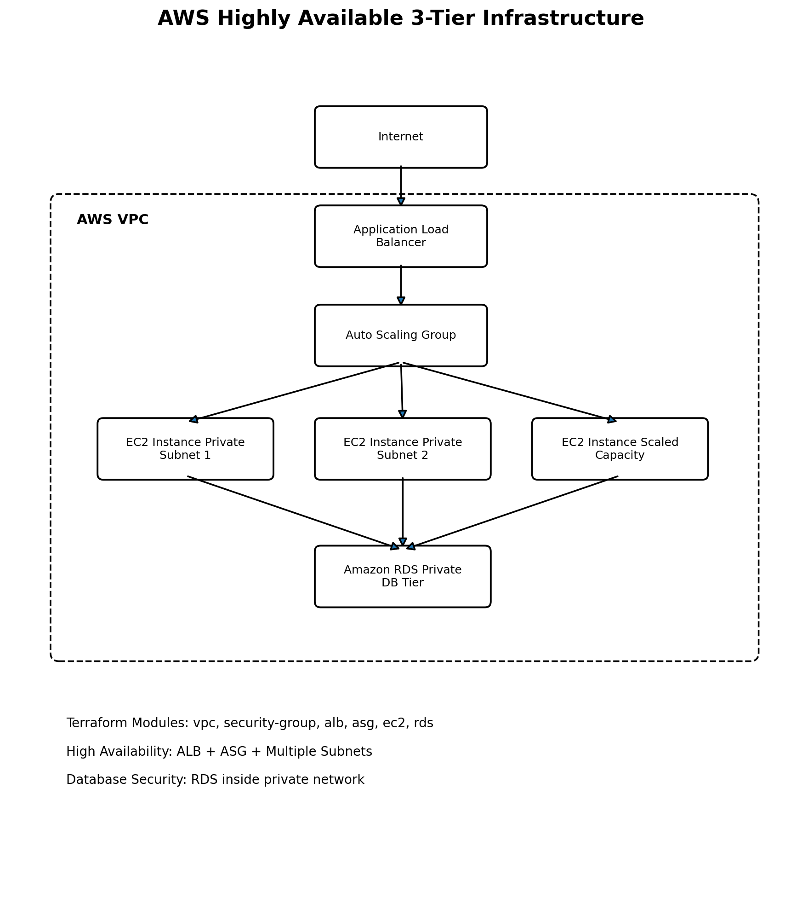
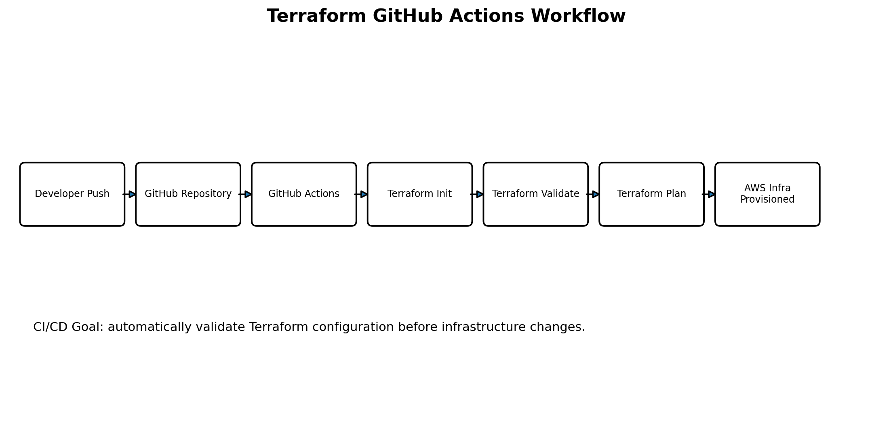

# AWS Highly Available 3-Tier Infrastructure using Terraform

A Terraform Infrastructure as Code project that provisions a highly available AWS 3-tier architecture using VPC, public/private subnets, Application Load Balancer, Auto Scaling Group, EC2 instances, RDS database, and GitHub Actions CI/CD automation.

---

## Project Overview

This project demonstrates how to design and provision production-style AWS infrastructure using Terraform modules.

The architecture separates the application into three layers:

1. **Networking Layer** - VPC, public subnets, private subnets, routing, and security groups
2. **Application Layer** - Application Load Balancer and Auto Scaling EC2 instances
3. **Database Layer** - Amazon RDS deployed inside private subnets

The project also includes GitHub Actions workflow support for Terraform validation and CI/CD automation.

---

## Key Features

- Modular Terraform infrastructure
- Custom VPC with public and private subnets
- Application Load Balancer for traffic distribution
- Auto Scaling Group for high availability
- EC2 application tier
- Amazon RDS database tier
- Security group based network access control
- GitHub Actions workflow for Terraform CI
- Terraform workspace-based environment scaling logic

---

## Architecture Diagram



---

## CI/CD Workflow Diagram



---

## Architecture

```text
Internet
   |
   v
Application Load Balancer
   |
   v
Auto Scaling Group
   |
   +--> EC2 Instance 1
   +--> EC2 Instance 2
   +--> EC2 Instance N
   |
   v
Amazon RDS Database

Inside AWS VPC:
- Public Subnets
- Private Subnets
- Security Groups
- ALB
- EC2 Auto Scaling Group
- RDS
```

---

## Terraform Modules

```text
modules/
├── vpc
├── security-group
├── alb
├── asg
├── ec2
└── rds
```

### Module Responsibilities

| Module | Purpose |
|---|---|
| vpc | Creates VPC, public subnets, private subnets, and networking components |
| security-group | Creates security rules for ALB, EC2, and RDS access |
| alb | Creates Application Load Balancer and target group |
| asg | Creates Auto Scaling Group for EC2 application instances |
| ec2 | Defines EC2 related configuration |
| rds | Creates RDS database inside private network |

---

## Project Structure

```text
terraform-aws-alb-asg/
│
├── .github/
│   └── workflows/
│       └── terraform.yml
│
├── modules/
│   ├── alb/
│   ├── asg/
│   ├── ec2/
│   ├── rds/
│   ├── security-group/
│   └── vpc/
│
├── docs/
│   ├── architecture.png
│   └── workflow.png
│
├── backend.tf
├── import-demo.tf
├── main.tf
├── outputs.tf
├── variables.tf
├── LICENSE
├── .gitignore
└── README.md
```

---

## Terraform Workspace Logic

This project uses Terraform workspace logic to adjust capacity between environments.

```hcl
desired_capacity = terraform.workspace == "prod" ? 3 : 1
min_size         = terraform.workspace == "prod" ? 2 : 1
max_size         = terraform.workspace == "prod" ? 5 : 2
```

---

## GitHub Actions CI/CD

Typical CI workflow:

```text
Developer Push
      |
      v
GitHub Repository
      |
      v
GitHub Actions
      |
      v
Terraform Init
      |
      v
Terraform Format Check
      |
      v
Terraform Validate
      |
      v
Terraform Plan
```

---

## Prerequisites

Before using this project, install and configure:

- Terraform
- AWS CLI
- Git
- AWS account
- IAM user or role with required permissions

Check installation:

```bash
terraform -version
aws --version
git --version
```

Configure AWS CLI:

```bash
aws configure
```

---

## Deployment Steps

### 1. Clone the Repository

```bash
git clone https://github.com/VishwaSabaris/terraform-aws-alb-asg.git
cd terraform-aws-alb-asg
```

### 2. Initialize Terraform

```bash
terraform init
```

### 3. Format Terraform Files

```bash
terraform fmt -recursive
```

### 4. Validate Configuration

```bash
terraform validate
```

### 5. Review Plan

```bash
terraform plan
```

### 6. Apply Infrastructure

```bash
terraform apply
```

### 7. Destroy Infrastructure

To avoid AWS charges:

```bash
terraform destroy
```

---

## Important Notes

- Do not commit AWS credentials to GitHub.
- Do not commit `.tfstate`, `.tfvars`, `.pem`, or secret files.
- Destroy infrastructure after testing to avoid AWS charges.
- Store sensitive variables securely using GitHub Secrets or environment variables.

---

## Security Practices

- RDS is placed inside private subnets.
- EC2 instances are managed through Auto Scaling Group.
- ALB handles public traffic.
- Security groups restrict inbound and outbound traffic.
- Terraform state files should not be publicly exposed.

---

## Future Improvements

- Add NAT Gateway for private subnet outbound access
- Add CloudWatch monitoring
- Add Route 53 custom domain
- Add HTTPS using AWS Certificate Manager
- Add WAF for application protection
- Add remote backend using S3 and DynamoDB locking
- Add separate dev/stage/prod workspaces
- Add automated deployment approval in GitHub Actions
- Add cost estimation using Infracost

---

## Learning Outcomes

Through this project, I gained practical experience in:

- AWS cloud infrastructure design
- Infrastructure as Code using Terraform
- Modular Terraform development
- VPC networking
- Load balancing
- Auto Scaling
- RDS database provisioning
- GitHub Actions CI/CD
- Cloud security fundamentals
- Production-style infrastructure planning

---

## Author

**Vishwa Sabaris V**

B.E. Computer Science and Engineering (Artificial Intelligence & Machine Learning)

Kalaignar Karunanidhi Institute of Technology (KIT), Coimbatore
